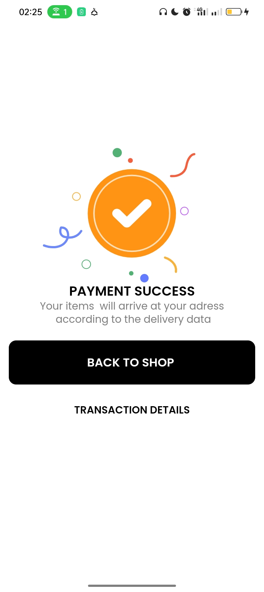
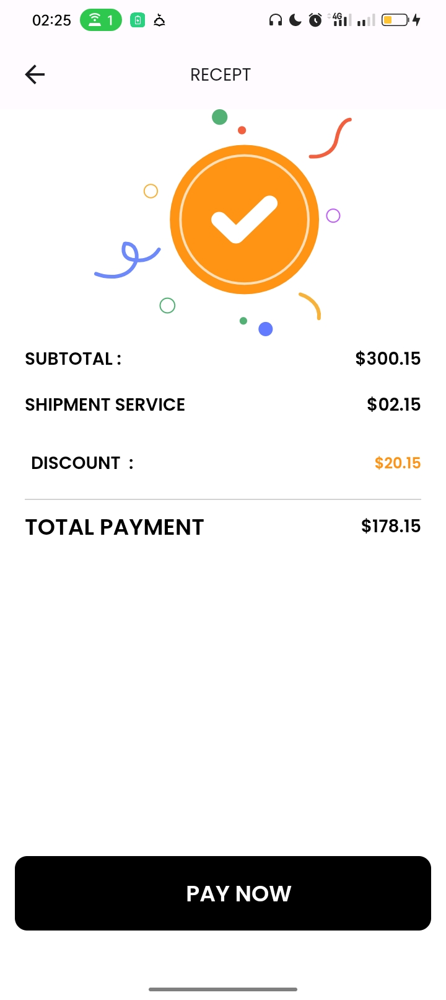
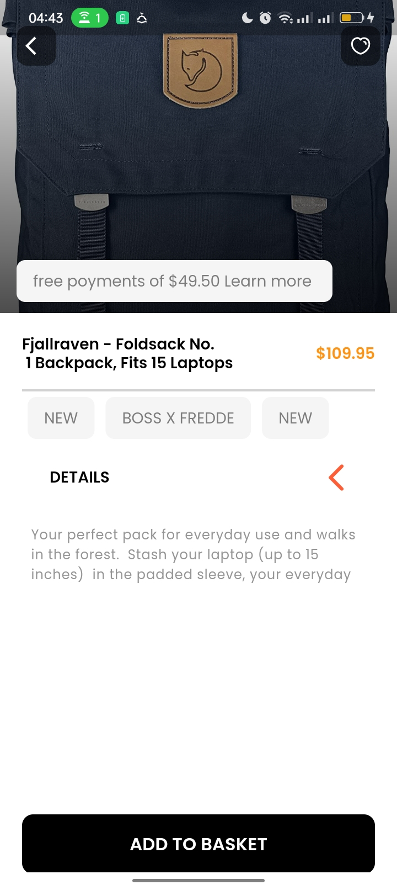
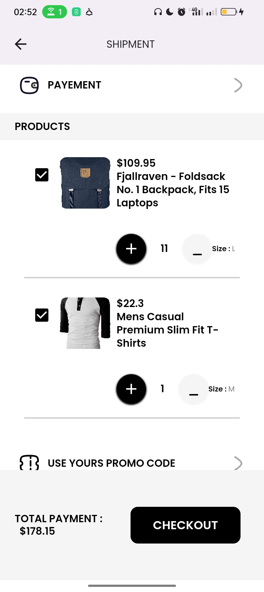
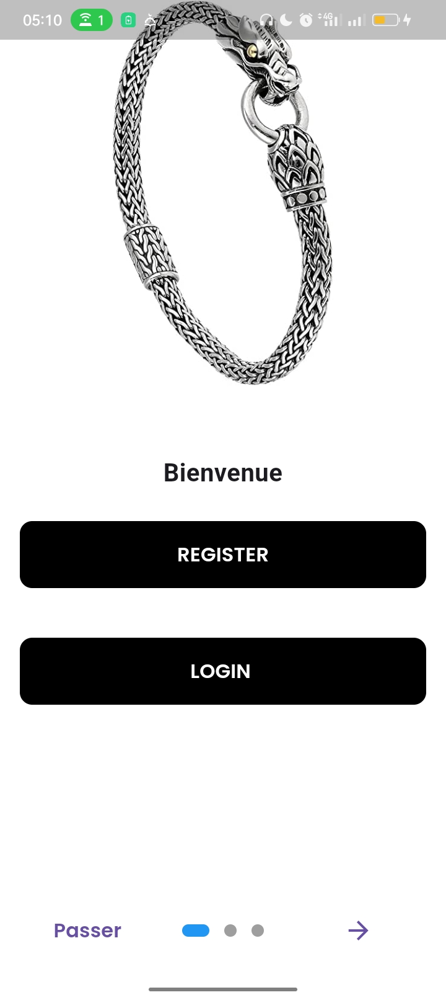

#  Application E-Commerce vivia_mobile

## Description
Une application mobile e-commerce développée avec Flutter.

## Captures d'écran
Insérez ici quelques captures d'écran de votre application pour donner un aperçu visuel.

 
 ){width=50px height=50px}
{width=50px height=50px}
{width=50px height=20px}
{width=50px height=50px}
{width=20px height=20px}
## Fonctionnalités
- Liste des fonctionnalités clés de votre application.

## Technologies Utilisées.
- Flutter
- Dart
- Autres dépendances...

## Installation
1. Cloner le référentiel.

## Getting Started

This project is a starting point for a Flutter application.

A few resources to get you started if this is your first Flutter project:

- [Lab: Write your first Flutter app](https://docs.flutter.dev/get-started/codelab)
- [Cookbook: Useful Flutter samples](https://docs.flutter.dev/cookbook)

For help getting started with Flutter development, view the
[online documentation](https://docs.flutter.dev/), which offers tutorials,
samples, guidance on mobile development, and a full API reference.
